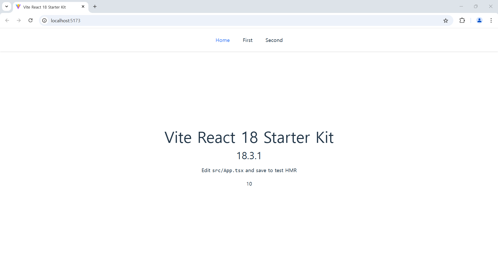

<h1>Vite React 18 Starter Kit</h1>


<br/>

<h2>Index</h2>

- [Introduction](#introduction)
- [Configuration](#configuration)

<br/>

## Introduction

This template provides a minimal setup for TypeScript and React 18 with Tailwind CSS and React Router.

<br/>

## Configuration

- `React v18.3.1`
- `Vite v6.0.5`
- `React Router v7.1.1`
- `Tailwind CSS v3.4.17`
- `prettier-plugin-tailwindcss v0.6.9`
- `Prettier`

  ```json
  {
    "semi": true,
    "singleQuote": false,
    "printWidth": 80,
    "trailingComma": "all",
    "tabWidth": 2,
    "useTabs": false,
    "bracketSpacing": true,
    "jsxSingleQuote": false,
    "arrowParens": "always",
    "endOfLine": "auto",
    "plugins": ["prettier-plugin-tailwindcss"]
  }
  ```

- `ESLint`

  ```javascript
  import js from "@eslint/js";
  import globals from "globals";
  import reactHooks from "eslint-plugin-react-hooks";
  import reactRefresh from "eslint-plugin-react-refresh";
  import tseslint from "typescript-eslint";

  export default tseslint.config(
    { ignores: ["dist"] },
    {
      extends: [js.configs.recommended, ...tseslint.configs.recommended],
      files: ["**/*.{ts,tsx}"],
      languageOptions: {
        ecmaVersion: 2020,
        globals: globals.browser,
      },
      plugins: {
        "react-hooks": reactHooks,
        "react-refresh": reactRefresh,
      },
      rules: {
        ...reactHooks.configs.recommended.rules,
        "react-refresh/only-export-components": [
          "warn",
          { allowConstantExport: true },
        ],
        semi: "error",
        quotes: "error",
        "jsx-quotes": "error",
        indent: ["error", 2, { SwitchCase: 1 }],
        "no-tabs": "error",
        "max-len": "off",
      },
    },
  );
  ```

- `Path alias`

  ```typescript
  import { defineConfig } from "vite";
  import react from "@vitejs/plugin-react-swc";
  import path from "path";

  // https://vite.dev/config/
  export default defineConfig({
    plugins: [react()],
    resolve: {
      alias: [{ find: "@src", replacement: path.resolve(__dirname, "./src") }],
    },
  });
  ```
